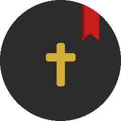
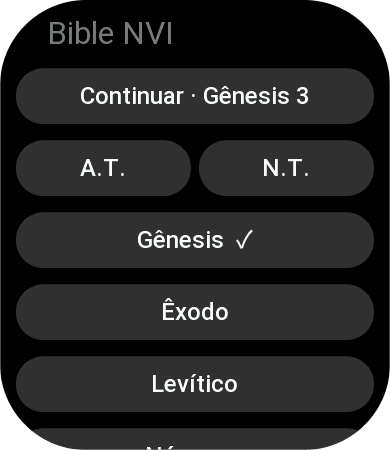
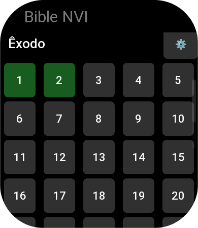
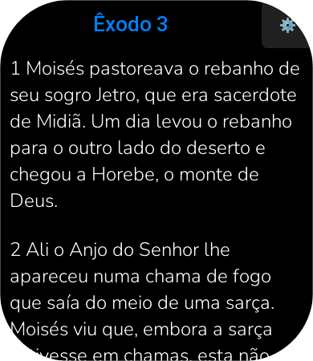
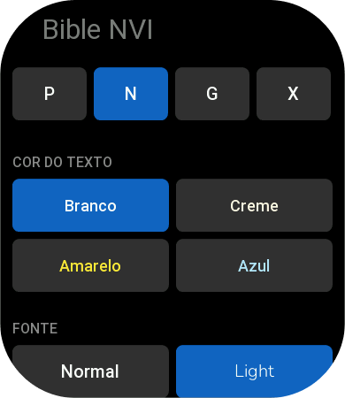

<div align="center">
  

  # Bíblia NVI para Zepp OS

  > A Bíblia Nova Versão Internacional direto no seu pulso — leve, rápida e com progresso de leitura.
</div>

---

## ✨ Funcionalidades

| Recurso | Detalhe |
|---|---|
| 📚 **Lista de livros** | Navegue pelo Antigo e Novo Testamento com abas separadas |
| 📑 **Capítulos** | Veja todos os capítulos do livro selecionado |
| 📝 **Leitura** | Versículos renderizados com rolagem nativa |
| 🔖 **Marcador** | Retome de onde parou com um toque |
| ✅ **Progresso** | Rastreamento de capítulos lidos por livro (com indicador `✓`) |
| ⚙️ **Configurações** | Tamanho da fonte, cor do texto e família tipográfica |
| 🗂️ **Opções do livro** | Marque todos os capítulos como lidos/não lidos ou redefina o progresso |

---

## 📸 Screenshots

<div align="center">
  <table>
    <tr>
      <td align="center">
        <br/>
        <sub><b>Lista de livros</b></sub>
      </td>
      <td align="center">
        <br/>
        <sub><b>Capítulos</b></sub>
      </td>
      <td align="center">
        <br/>
        <sub><b>Leitura</b></sub>
      </td>
      <td align="center">
        <br/>
        <sub><b>Configurações</b></sub>
      </td>
    </tr>
  </table>
</div>

---

## 🗺️ Páginas

### Livros (`page/books`)
- Abas **A.T.** / **N.T.** para alternar entre os testamentos
- Botão de acesso rápido **"Continuar ·"** baseado no último marcador salvo
- Ícone `✓` nos livros com 100% de leitura concluída

### Capítulos (`page/chapters`)
- Todos os capítulos do livro em grade scrollável
- Capítulos já lidos destacados em verde
- Acesso às opções do livro pelo canto superior

### Leitura (`page/reading`)
- Exibe o texto versículo a versículo
- Salva o marcador e registra o progresso automaticamente ao abrir
- Botões de navegação **Anterior** / **Próximo** ao final
- Botão ⚙ para ir às configurações

### Configurações (`page/settings`)
- **Tamanho da letra:** P · N · G · X
- **Cor do texto:** Branco · Creme · Amarelo · Azul
- **Fonte:** Normal · Light (Nunito)

### Opções (`page/options`)
- Marcar todos os capítulos como lidos
- Marcar todos como não lidos
- Limpar todo o progresso (com confirmação)

---

## 🛠️ Stack

- **Zepp OS SDK** — API nativa de UI e armazenamento local
- **ZML** (`@zeppos/zml`) — Camada base de `App` e `Page`
- **JavaScript** puro (sem bundler externo)
- **Zeus CLI** — build, preview e deploy

---

## 🚀 Como rodar

```bash
# Instalar dependências
npm install

# Rodar no simulador
npm run dev

# Build para produção
npm run build

# Preview no dispositivo via bridge
npm run bridge
```

> **Requisito:** Zeus CLI instalado e configurado. Consulte a [documentação Zepp OS](https://docs.zepp.com).

---

## 📂 Estrutura

```
bible-zepp/
├── app.js                  # Entrypoint do app
├── app.json                # Manifest (appId, targets, permissões)
├── nvi.json                # Texto bíblico (NVI)
├── page/
│   ├── books/              # Lista de livros (A.T. / N.T.)
│   ├── chapters/           # Lista de capítulos
│   ├── reading/            # Tela de leitura
│   ├── settings/           # Configurações de aparência
│   └── options/            # Opções de progresso por livro
├── utils/
│   ├── bible-meta.js       # Metadados dos livros (nomes, nº de capítulos)
│   ├── bookmark.js         # Salvar/carregar marcador
│   ├── progress.js         # Rastrear capítulos lidos
│   ├── settings.js         # Preferências de leitura
│   ├── fs-helper.js        # Leitura do arquivo bíblico
│   ├── vstack.js           # Utilitário de layout vertical
│   └── config/             # Constantes de layout e device
└── assets/
    └── fonts/
        └── Nunito-Light.ttf
```

---

## ⌚ Dispositivos suportados

| Perfil | Largura |
|---|---|
| `r` (round large) | 480 px |
| `s` (round small) | 390 px |

O layout é ajustado automaticamente via `zosLoader` com arquivos `.r.layout.js` e `.s.layout.js`.

---

## 🌐 Idiomas

- `pt-BR` — Português (padrão)
- `en-US` — Inglês

---

## 📜 Licença

ISC
